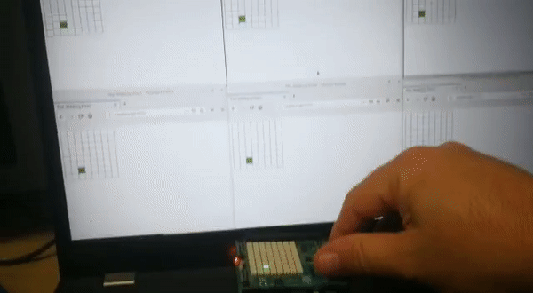

# The Walking Pixel
The walking pixel is running on a [Raspberry Pi](https://www.raspberrypi.org/) with a [Sense HAT](https://www.raspberrypi.org/products/sense-hat/?resellerType=home). 

It's presenting a pixel on the Sense HAT 8X8 display. The pixel is moving using the Sense HAT's joystick. Pressing the joystick changes
the pixel color to a random one.

In addition, it's also running a web server that serve an HTML page. This page is presenting the same display as the Sense HAT
display, and is stays sync with the hat display using a websocket.



## The Project
This silly project is just an exercise. I just wanted to play with go programming language with Raspberry Pi. 

This project deals with
* golang concurrency, including go-routines, channels and Mutexes.
* writing golang software for Raspberry Pi
* using a websocket from the backend and the frontend

## Technical Details
* Hardware: 
  * Raspberry Pi 3B
  * Sense HAT
* golang version: 1.11.6 (that was the latest version for Raspberry Pi when I was writing this project)
* Libraries:
  * [bobblehat](https://github.com/nathany/bobblehat) - a golang library to work with the Sense Hat
  * [Gorilla websocket](github.com/gorilla/websocket) - a go library to work with websockets

## Building
This chapter assumes the existence of a Raspberry Pi with a Sense Hat, and that it's either connected to a keyboard and 
a monitor, or can be accessed by SSH.

First, install golang:
```bash
sudo apt-get install golang
```

Then copy the project files or clone them, to `${GOROOT}/src/github.com/nunnatsam/walkingHat/`

To build the software:
```bash
go build .
```

The `walkingHat` executble file should be created in a few seconds. 

Just run it like this:
```bash
./walkingHat
```

open a web browser at `http://<your raspberry pi hostname>:8080` from any device connected to the same network as the Raspberry pi.
